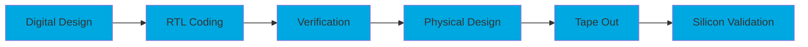

<div align="center">
  
</div>

<p align="center">
  
</p>

<div align="center">
  
[](https://linkedin.com/in/udayneti)
[](https://github.com/udayneti)
[](mailto:udayneti@gmail.com)
[](https://udayneti.github.io)

</div>

---

## 🎯 About Me

```verilog
module UdayNeti (
    input wire curiosity,
    input wire passion,
    output reg innovation,
    output reg success
);
    
    always @(posedge curiosity or posedge passion) begin
        innovation <= 1'b1;
        success <= 1'b1;
    end
    
endmodule
```

🔬 **Electronics & VLSI Engineer** passionate about designing cutting-edge digital systems and pushing the boundaries of semiconductor technology.

- 🔭 Currently working on advanced **RTL Design** and **Verification** projects
- 🌱 Exploring **AI/ML accelerators** and **low-power design techniques**
- 💡 Interested in **ASIC/FPGA** design, **SoC architecture**, and **physical design**
- 🎓 Constantly learning about emerging **EDA tools** and **verification methodologies**
- ⚡ Fun fact: I can debug SystemVerilog like reading a novel! 📚

---

## 🛠️ Tech Stack & Tools

<div align="center">

### 💻 Hardware Description Languages


### 🔧 EDA Tools & Platforms


### 📊 Verification & Simulation


### 🖥️ Programming & Scripting


### 🔬 Physical Design & Analysis


### 🧰 Development Tools


</div>

---

## 💼 Core Competencies

<table align="center">
<tr>
<td align="center" width="33%">

### 🎨 Digital Design
- RTL Design & Coding
- FSM Design
- Datapath Design
- Pipeline Architecture
- Clock Domain Crossing
- Low Power Design

</td>
<td align="center" width="33%">

### ✅ Verification
- UVM Testbench
- Assertion Based Verification
- Coverage Driven Verification
- Constrained Random Testing
- Functional Coverage
- Code Coverage Analysis

</td>
<td align="center" width="33%">

### 🔌 Physical Design
- Floorplanning
- Placement & Routing
- Clock Tree Synthesis
- Static Timing Analysis
- Power Analysis
- DRC/LVS Checks

</td>
</tr>
</table>

<p align="center">
  
</p>

---

## 📊 GitHub Stats

<div align="center">
  
  
</div>

<div align="center">
  
</div>

<div align="center">
  
</div>

---

## 🏆 GitHub Trophies

<div align="center">
  
</div>

---

## 🚀 Current Focus

```systemverilog
class CurrentProjects;
    
    string projects[$] = {
        "🔧 Designing high-performance processor cores",
        "🧪 Building advanced UVM verification environments",
        "⚡ Optimizing low-power SoC architectures",
        "🤖 Exploring AI/ML hardware accelerators",
        "📡 Working on high-speed communication interfaces"
    };
    
    function void display();
        $display("========================================");
        $display("       🎯 CURRENT PROJECTS 🎯");
        $display("========================================");
        foreach(projects[i])
            $display("%0d. %s", i+1, projects[i]);
    endfunction
    
endclass
```

---

## 📚 Learning Journey

<div align="center">



</div>

---

## 🌐 Connect With Me

<div align="center">
  
I'm always excited to collaborate on interesting projects, discuss chip design, or just chat about technology!

[](https://linkedin.com/in/udayneti)
[](https://twitter.com/udayneti)
[](mailto:udayneti@gmail.com)
[](https://udayneti.github.io)

</div>

---

## 💭 Quote

<div align="center">
  
_"The best way to predict the future is to design it."_ 


</div>

---

<div align="center">
  
### ⚡ From Idea to Silicon ⚡


**Thanks for visiting! ⭐ Star my repositories if you find them interesting!**

</div>


